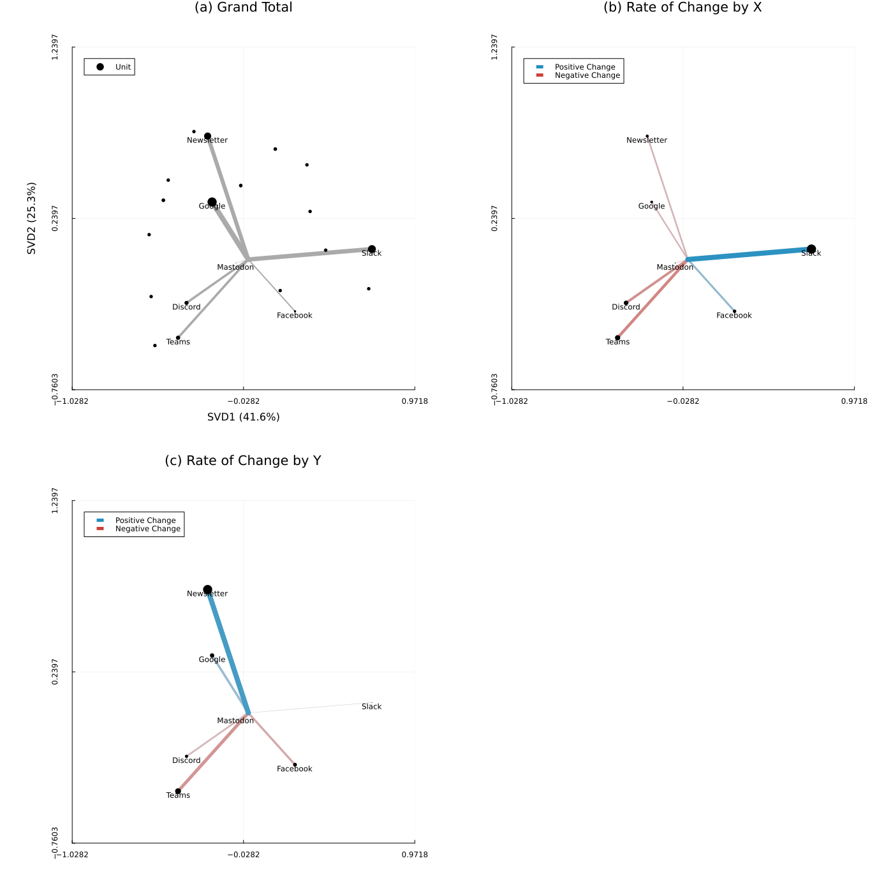
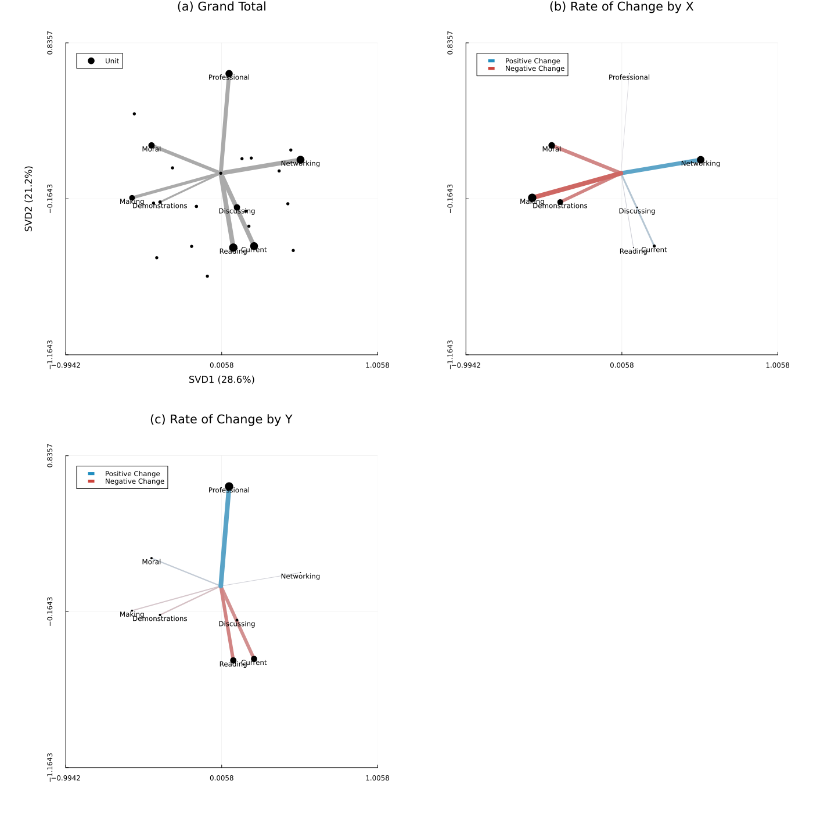

# evil-spring2024-survey-analysis

## Meeting Time

There was a clear preference for 10am - 11am in the responses. This was supported by a range of written comments clarifying that other times would conflict with other groups and activities on campus that our members may also be interested in.

## Communication

Looking at an SVD of the communication responses, 67.9% of the variance is explained by a three-way split:

- Those who prefer Slack
- Those who prefer some kind of email blast, such as Google Group or Newsletter
- Those who prefer messaging platforms, like Discord and Teams

Facebook Groups and Mastodon received too low of support for analysis of variance.

With this in mind, I will:

- Continue to maintain the Slack channel
- Continue to use Teams to hold virtual meetings
- Create a Google Group for managing email blasts
- Create a sign-up form to make joining the Slack and Google Group (a) easier on the participant when joining and (b) easier on me when validating email ownership

## Activities

Looking at an SVD of the activities responses, 49.8% of the variance is explained by a four-way split:

- Those who see value in networking with others
- Those who see value in practicing new methods, whether moral, technical, or hands-on
- Those who see value in professional development
- Those who see value in the core activities of a reading group: reading papers, discussing with peers, and staying up-to-date

With this in mind, I will:

- Continue to maintain the core activities of the group
- Work with the other facilitators to prepare break-out group prompts to support networking and practicing methods; and as time goes on once we've demonstrated these sort of prompts enough, involve the participants in coming up with these prompts together on-the-fly
- Create informal space for, and develop norms for, more senior members to speak 1-on-1 with other members in a mentor/mentee capacity

## In-Person Spring Kickoff

There was not overwhelming support for an in-person spring kickoff meeting, with some respondents writing in that meeting in person would be prohibitive for them. Moreover, most respondents said that they had never attended an EVIL meeting before.

With that in mind, I will not hold an in-person spring kickoff. I believe it is more important to involve the new members as soon as possible in the regular activities of the group.